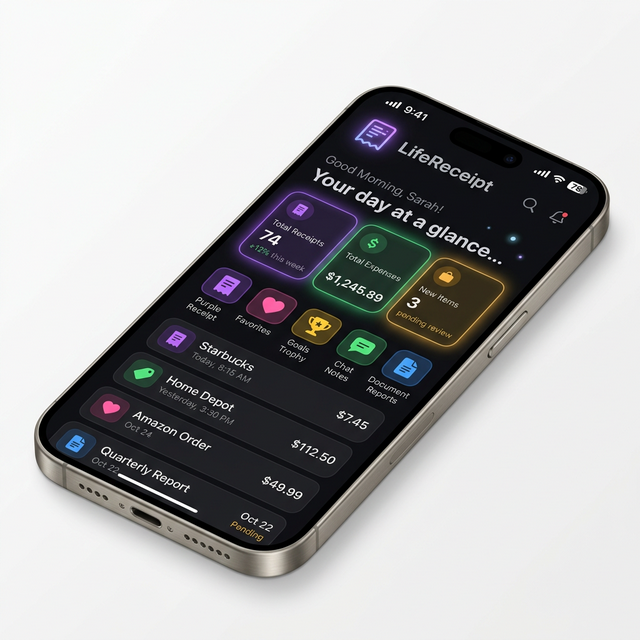

  
  <h1>LifeReceipt 📱🧾</h1>
  
<strong>Your Personal Life Vault</strong>

  
  

    <a href="https://arpit0381.github.io/LifeReceipt/"><strong>View Live Website »</strong></a>
  

 

## 🌟 About LifeReceipt

**LifeReceipt** is a premium, secure personal life vault application designed to securely store and manage your receipts, health records, achievements, conversations, and personal documents. Everything stays strictly on your device.

This repository hosts the **Landing Page** for the LifeReceipt app—featuring a modern glassmorphism dark theme and a seamless installation flow to get the app on your Android device locally.

## ✨ Features

- **Store Receipts & Expenses**: Keep track of your bills and warranties efficiently.
- **Health Graph & Records**: Save and monitor critical health details over time.
- **Life Dashboard**: Record your personal achievements safely.
- **Biometric Security**: Your vault is protected by PIN or your face/fingerprint.
- **Offline First**: All your data is privately stored strictly on your device.

## 🚀 Landing Page Preview

  

## 🌐 Deployment
This single-page site uses embedded base64 assets and responsive Vanilla CSS. It is deployed using **GitHub Pages**. 

You can view it live directly at: [https://arpit0381.github.io/LifeReceipt/](https://arpit0381.github.io/LifeReceipt/)

## 🛠 Install The App

To install the app, visit the landing page from your phone, download the official **Release APK**, and open it in your file manager to install.

---

  
Built with ❤️ By Arpit Bajpai &nbsp;&middot;&nbsp; <b>LifeReceipt</b> &copy; 2026

